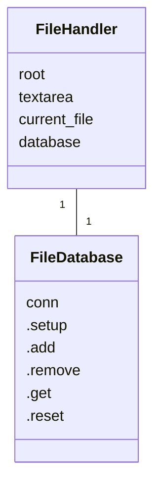
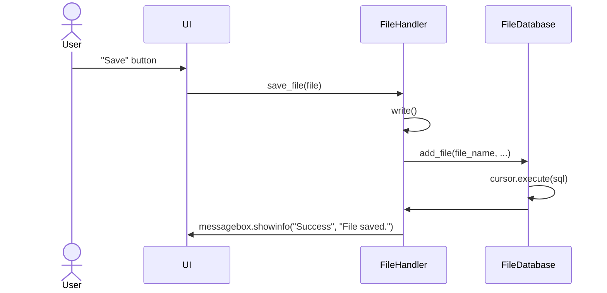

# Arkkitehtuurikuvaus
## Rakenne
Sovelluksen rakenne koostuu editorin toiminnallisuuksista, tiedostojen käsittelystä, ja käyttöliittymästä vastaavista komponenteista.

## Sovelluslogiikka

Sovelluksen logiikka kohdentuu tiedostojen käsittelyyn, josta vastaa luokat FileHandler ja FileDatabase. FileDatabase vastaa myös tietokannasta, jota käsitellään käyttöliittymän kautta.

## Käyttöliittymä

Käyttöliittymästä vastaavat luokat UI, EditorMain, VisualEditor, ja SourceEditor.

### Tiedoston avaaminen

Alla oleva sekvenssikaavio kuvaa sitä, miten tiedoston tallentaminen onnistuu käyttöliittymästä:

