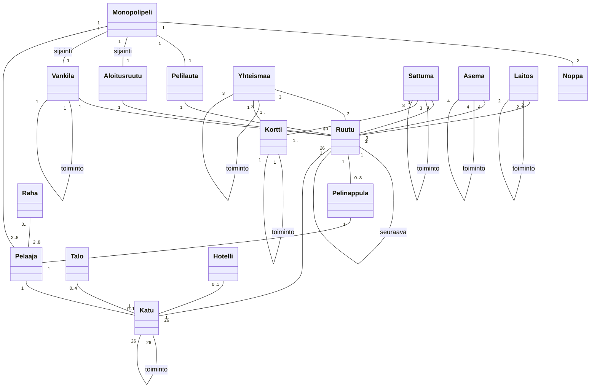

```mermaid
 classDiagram
    Monopolipeli "1" -- "2" Noppa
    Monopolipeli "1" -- "1" Pelilauta
    Pelilauta "1" -- "40" Ruutu
    Ruutu "1" -- "1" Ruutu : seuraava
    Ruutu "1" -- "0..8" Pelinappula
    Pelinappula "1" -- "1" Pelaaja
    Pelaaja "2..8" -- "1" Monopolipeli
    Aloitusruutu "1" -- "1" Ruutu
    Vankila "1" -- "1" Ruutu
    Vankila "1" -- "1" Vankila : toiminto
    Yhteismaa "3" -- "3" Ruutu
    Yhteismaa "3" -- "3" Yhteismaa : toiminto
    Sattuma "3" -- "3" Ruutu
    Sattuma "3" -- "3" Sattuma : toiminto
    Asema "4" -- "4" Ruutu
    Asema "4" -- "4" Asema : toiminto
    Laitos "2" -- "2" Ruutu
    Laitos "2" -- "2" Laitos : toiminto
    Katu "26" -- "26" Ruutu
    Katu "26" -- "26" Katu : toiminto
    Monopolipeli "1" -- "1" Aloitusruutu : sijainti
    Monopolipeli "1" -- "1" Vankila : sijainti
    Sattuma "1" -- "1.." Kortti
    Yhteismaa "1" -- "1.." Kortti
    Kortti "1" -- "1" Kortti : toiminto
    Talo "0..4" -- "1" Katu
    Hotelli "0..1" -- "1" Katu
    Pelaaja "1" -- "0..1" Katu
    Raha "0.." -- "2..8" Pelaaja
```