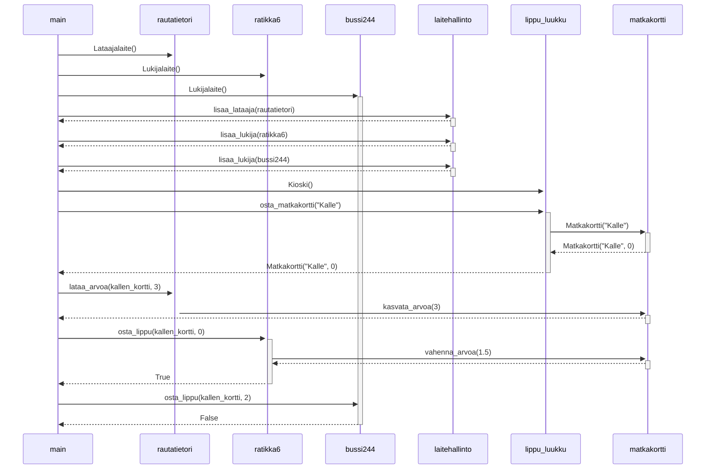

```mermaid
sequenceDiagram
    main->>+rautatietori: Lataajalaite()
    main->>+ratikka6: Lukijalaite()
    main->>+bussi244: Lukijalaite()
    main->>+laitehallinto: lisaa_lataaja(rautatietori)
    laitehallinto-->>-main: 
    main->>+laitehallinto: lisaa_lukija(ratikka6)
    laitehallinto-->>-main: 
    main->>+laitehallinto: lisaa_lukija(bussi244)
    laitehallinto-->>-main: 
    main->>+lippu_luukku: Kioski()
    main->>+lippu_luukku: osta_matkakortti("Kalle")
    lippu_luukku->>+matkakortti: Matkakortti("Kalle")
    matkakortti-->>-lippu_luukku: Matkakortti("Kalle", 0)
    lippu_luukku-->>-main: Matkakortti("Kalle", 0)
    main->>+rautatietori: lataa_arvoa(kallen_kortti, 3)
    rautatietori->>+matkakortti: kasvata_arvoa(3)
    matkakortti-->>-main: 
    main->>+ratikka6: osta_lippu(kallen_kortti, 0)
    ratikka6->>+matkakortti: vahenna_arvoa(1.5)
    matkakortti-->>-ratikka6: 
    ratikka6-->>-main: True
    main->>bussi244: osta_lippu(kallen_kortti, 2)
    bussi244-->>-main: False
```